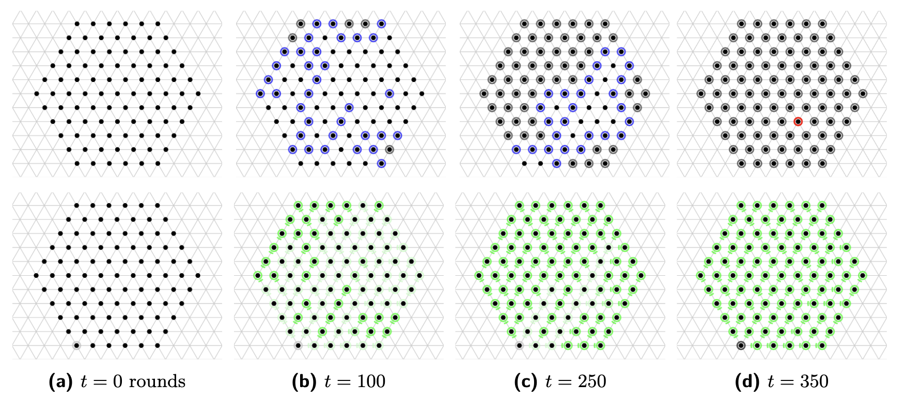

## Overview

I worked with the [Self-Organizing Particle Systems (SOPS) Lab](https://sops.engineering.asu.edu/) at Arizona State University from March 2021 to October 2025 on distributed algorithms for *programmable matter*. Programmable matter is envisioned as a swarm of simple, identical modules ("amoebots") that collectively change shape, move, and reconfigure based on local rules alone. Each particle has no global view, no central coordinator, and very limited memory. The interesting question is: what can a swarm like that actually accomplish, and under what assumptions?

## The problem

Most existing algorithms for the amoebot model assume particles have unlimited energy and that the order in which they act is friendly. Neither is realistic. Real particles would draw energy from their environment and share it with neighbors, and a worst-case scheduler (an "unfair adversary") could delay some particles arbitrarily while activating others repeatedly. That kind of scheduling can break algorithms that depend on things happening in a nice order.

We wanted a general framework that could take an existing energy-agnostic algorithm and automatically produce an energy-constrained version of it that still works correctly under an unfair adversary.

## What we built

The paper introduces an **energy distribution framework** that transforms any "energy-compatible" amoebot algorithm *A* into an energy-constrained version *Aδ* with two guarantees:

1. Any system outcome produced by *Aδ* could also have been produced by the original *A*. In other words, the transformation preserves correctness.
2. The transformation costs only an O(n²) runtime overhead.

The framework works by layering two behaviors on top of the base algorithm: `HarvestEnergy`, in which *source* amoebots draw energy from external sources into their batteries, and `ShareEnergy`, in which any non-idle amoebot with spare energy passes a unit to a neighbor whose battery isn't full. Combined with a spanning-forest structure over the particle system, this ensures energy propagates through the swarm quickly enough that the underlying algorithm still makes progress even under adversarial scheduling.

## My contributions

- **Algorithm design.** Co-wrote the proposed algorithm within the Amoebot Model and its technical explanation in the paper.
- **Simulator implementation.** Implemented the algorithm in [AmoebotSim](https://github.com/SOPSLab/AmoebotSim), the SOPS Lab's open-source C++ visual simulator for the amoebot model. Files I contributed to in the `alg/` directory are the ones prefixed with `edf` (for *energy distribution framework*).
- **Composition and validation.** Composed the energy-distribution layer with two underlying algorithms — a hexagon-formation algorithm and a leader-election algorithm — and ran simulations to verify that the composed systems still produced correct outcomes under the energy constraints.

Because a senior PhD student handled the final commits to the public SOPSLab repository, individual commit history for my work lives in the lab's private development fork rather than the public one.

## Publication

Jamison W. Weber, **Tishya Chhabra**, Andréa W. Richa, and Joshua J. Daymude. *Energy-Constrained Programmable Matter Under Unfair Adversaries.* 27th International Conference on Principles of Distributed Systems (OPODIS), December 2023. [[paper]](https://doi.org/10.4230/LIPIcs.OPODIS.2023.7) [[full version]](https://arxiv.org/abs/2309.04898)

## Broader work at SOPS

Alongside this project, I contributed to a second SOPS Lab paper on asynchronous deterministic leader election in three-dimensional programmable matter, published at ICDCN 2023. I also participated in weekly lab seminars on distributed computing, stochastic processes, and quantitative complexity.

## Links

- AmoebotSim: <a href="https://github.com/SOPSLab/AmoebotSim"><i class="large github icon"></i>SOPSLab/AmoebotSim</a>
- OPODIS 2023 paper: [10.4230/LIPIcs.OPODIS.2023.7](https://doi.org/10.4230/LIPIcs.OPODIS.2023.7)
- SOPS Lab: [sops.engineering.asu.edu](https://sops.engineering.asu.edu/)